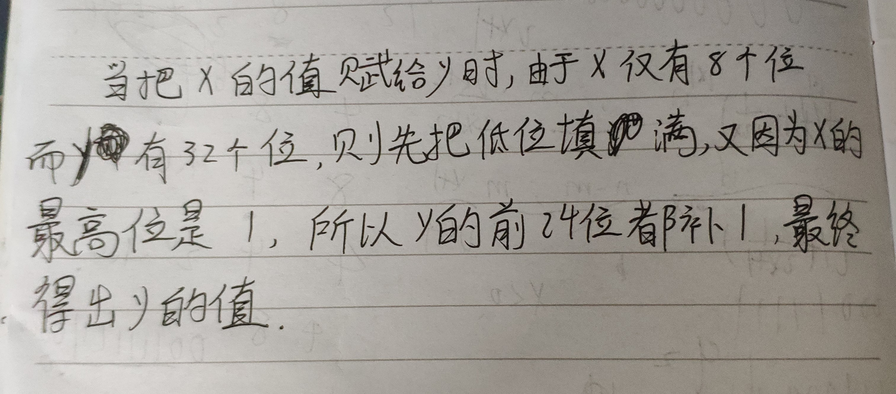

# Q:Write out variables  x, y and z in binary code 


1) int8_t x = 67;  int8_t y = -7;   int8_t z = y - x; 

2) int8_t x = 0xd3; 

3) uint8_t = 0xd3; 

4) int8_t x = 127;  int8_t y = -7;   int8_t z = y – x;

5) float x = 1.125; 

6) float x = 23.0; 

7) float x = 0.45;

上述代码中，哪些出现溢出错误，哪些出现精度误差。

## A:
1. **x = 01000011**
   
   **y = 11111001**
   
   **z = 01001010**

2. **x = 溢出**

3. **x = 11010011**

4. **x = 01111111**
   
   **y = 11111001**
   
   **z = 溢出**

5. **x = 0 01111111 0010000000000000000000(Excess_127)**

6. **x = 0 10000011 0111000000000000000000(Excess_127)**

7. **x = 精度误差**


# 使用维基百科，解释以下概念。 

1)Method of complements 

2)Byte 

3)Integer (computer science) 

4)Floating point


## A:

|objects|description|中文解释|
|:-------:|:-----------:|:-----:|
|**Method of complements**|In mathematics and computing, the method of complements is a technique used to subtract one number from another using only addition of positive numbers.|补码法是一种仅使用额外的正数来抽象出另一个数的的技术|
|**Byte**|The byte is a unit of digital information that most commonly consists of eight bits, representing a binary number. |字节通常包含8个位，是数据信息的一个单元，代表一个二进制数。|
|**Integer (computer science)**|In computer science, an integer is a datum of integral data type, a data type that represents some range of mathematical integers.|整形数是指一种描述数学上整数的数据类型|
|**Floating point**|The term floating point refers to the fact that a number's radix point (decimal point, or, more commonly in computers, binary point) can "float"; that is, it can be placed anywhere relative to the significant digits of the number.|浮点的来由是小数点的可移动性|


## 仔细阅读” Method of complements”的内容，你将注意到 nines‘ complement in the decimal 和 ones’ complement in binary 等概念. 

1)请证明：二进制的负数（two‘s complement of X）等于 X 的 ones’ complement  ＋ 1（即，X每位求反加1） 

### A:


2)Int8_t x = - 017; 请用8进制描述变量 x。在c中 017 即 (017)<sub>8</sub>

### A:

**x = 061**

## 阅读维基百科” Two‘s complement”的内容，特别是Sign extension小节内容。 

1)C程序：

```
int8_t  x = -0x1f;  
int y = x; 
``` 

请用16进制描述变量 x 和 y，并说明 int y = x 的计算过程。 

### A:

**x = 0xe1**

**y = 0xffffffe1**



2)请用数学证明，为什么可以这么计算。

### A:


## 阅读维基百科” Floating point”的内容， 

1)   NaN 是什么？


