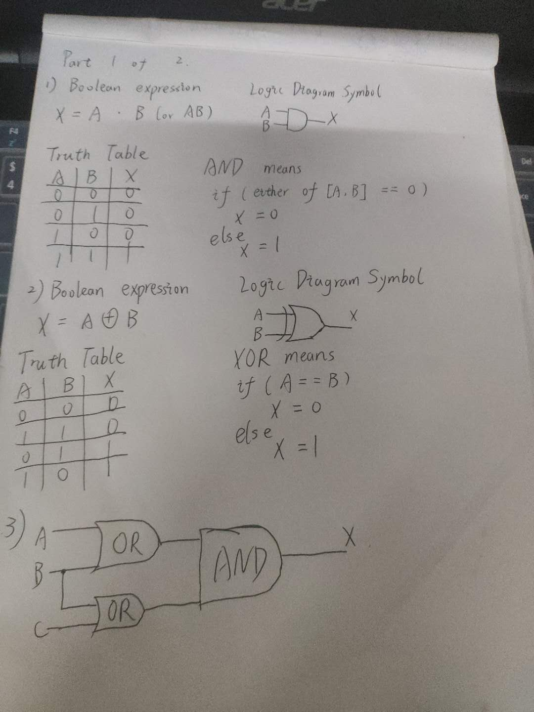
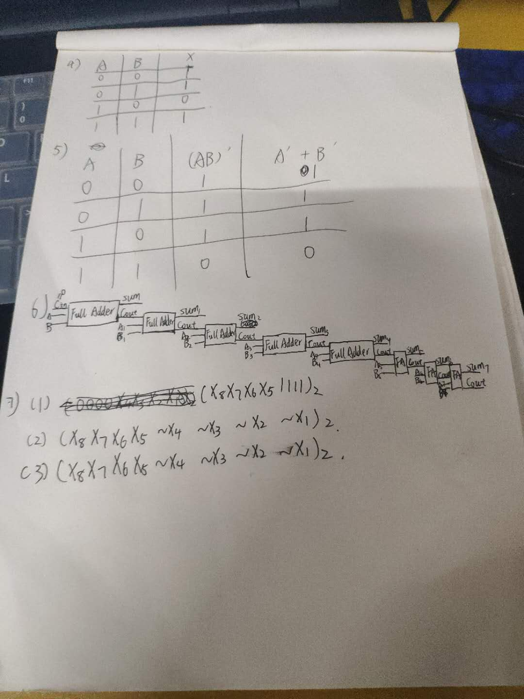

本次作业手写部分较多...

## 使用维基百科，解释以下概念。 

|objects|description|中文解释|
|:--:|:----:|:--:|
|Logic gate|In electronics, a logic gate is an idealized or physical device implementing a Boolean function; that is, it performs a logical operation on one or more binary inputs and produces a single binary output.|逻辑门电路接受一个或多个二进制输入却仅输出一个简单的二进制数(逻辑门用于执行布尔运算)|
|Boolean Algebra|In mathematics and mathematical logic, Boolean algebra is the branch of algebra in which the values of the variables are the truth values true and false, usually denoted 1 and 0 respectively.|布尔代数是数学的一个分支，主要研究真假值及其逻辑运算|

## 自学存储电路

1. Flip-flop means 触发器

2. Only one bit.