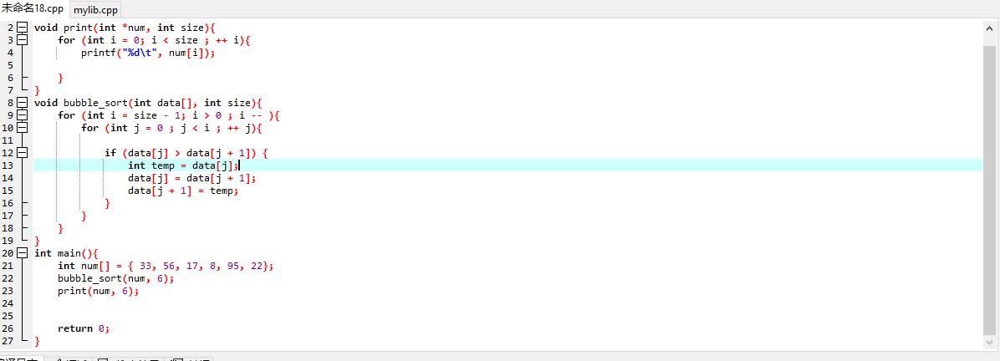
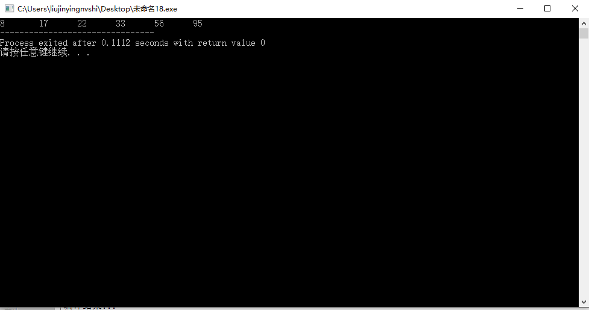

# 1. Bubble Sort the list: 33, 56, 17, 8, 95, 22。Make sure the final result is from small to large. Write out the list after the 2nd pass. (10 points) 

```c
void bubble_sort(int *data, int size){
    for (int i = size - 1 ; i > 0 ; -- i){
        for(int j = 0 ; j < i ; ++ j){
            if (data[j] > data[j + 1]){
                int temp = data[j];
                data[j] = data[j + 1];
                data[j + 1] = temp;
            }
        }
    }
}
```





# 2. Give a sorted array as list={60,65,75,80,90,95}. Design an algorithm to insert the value of x into the sorted array. Then test the algorithm with value 50,67,99. 思考：为什么选择插入点在list头上、中间、尾巴上的三个数作为算 法测试的数据，你能解释吗？

```
input list
input ins_num
FOR EACH item in list
    IF item > ins_num
        list.insert(ins_num, item) //insert ins_num just before item
    ENF IF
END FOR        
```

A:<br/>
    插入数据只可能在list的开头，中间和结尾，尤其是中间位置，个人认为选择中间任意一个位置都是等价的，选择这三个位置的数据能更加检验算法的可行性；

# 3. What is the state of the stack after the following sequence of Push and Pop operations? Push “anne”; Push “get”; Push “your” ; Pop; Push “my” Push “gun” 

```c
stack <- "anne"
stack <- "get"
stack <- "your"
stack -> "your"
stack <- "my"
stack -> "gun"
getNowStack();  // "anne get my gun"
```