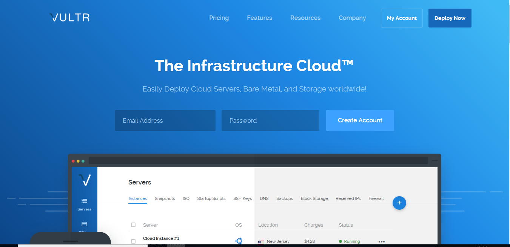
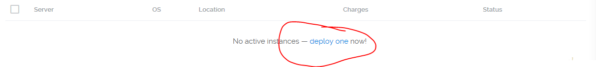
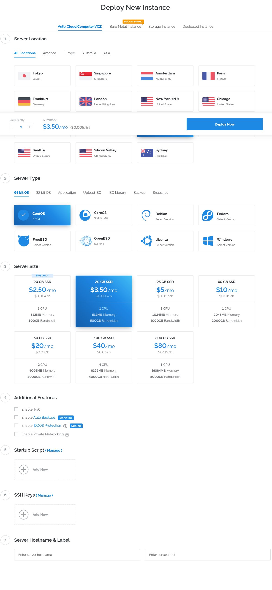
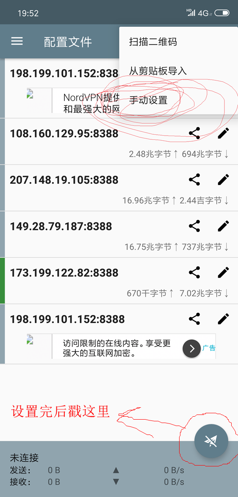
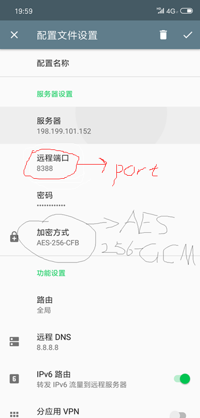

---

title: HandsomeXie's blog
layout: default

---


# 如何通过shadowsocks实现科学上网
相比于VPN，ss有更高的稳定性和安全度，并且相对于某些知名VPN，搭建ss所需的成本也更低。

*********************

## VPS

>A Virtual Private Server (VPS) is a virtual machine sold as a service by an Internet hosting service.   --wikipedia

简单地讲，vps就是虚拟服务器，搭建ss服务要求一台国外的服务器作为跳板。

目前国外的vps商主要有digitalocean，vultr，aws等，想了解便宜好用的VPS请戳，本文使用**vul**举个栗子。


1. 注册

。进去以后应该如下：



2. 充值credits

vultr使用租借制，按小时收费。比较人性化的是，vultr支持支付宝（Alipay）以及微信支付（WeChatPay）


### 租借服务器
1. **deploy one**



2. **choose your plan**




3. 使用ssh登录服务器

Windows端推荐使用

4. 使用ss一键脚本（**爱折腾的朋友可以自己写脚本**）

    在命令行里复制粘贴（***鼠标右键***）以下代码即可
    ```
    wget --no-check-certificate -O shadowsocks-all.sh https://raw.githubusercontent.com/teddysun/shadowsocks_install/master/shadowsocks-all.sh
    chmod +x shadowsocks-all.sh
    ./shadowsocks-all.sh 2>&1 | tee shadowsocks-all.log
    ```

5. 跟随指引设置端口，密码（~~不懂的朋友默认即可~~）

## 客户端（Android）

1. 下载ss客户端 

  

2. 配置服务器






3. 体验科学上网的乐趣！

# 感谢阅读！


