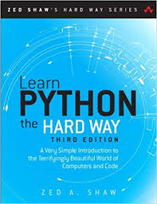
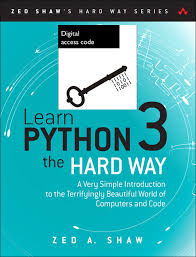

# 推荐图书《Learn Python the Hard Way》(又名:笨办法学Python)

 

||| **Also, another edition《Learn Python3》**

## 作者:Zed.A.Shaw

Zed A. Shaw is the author of the popular online books Learn Python the Hard Way, Learn Ruby the Hard Way, and Learn C the Hard Way. He is also the creator of several open source software projects like Mongrel, Lamson, Mongrel2, and has been programming and writing for nearly 20 years.Shaw is also behind an initiative entitled, "Programming, Merfu**er" the manifesto for which he claims that his group of programmers are "tired of being told we're autistic idiots who need to be manipulated to work in a Forced Pair Programming chain gang."

## an introduction

 Master Python and become a programmer-even if you never thought you could! This breakthrough book and CD can help practically anyone get started in programming. **It's called "The Hard Way," but it's really quite simple.** What's "hard" is this: it requires *discipline*, *practice*, and *persistence*. Zed A. Shaw teaches the Python programming language through a series of 52 brilliantly-crafted exercises-all formatted consistently, and most no longer than two pages (including "extra credit"). 
 
 Just read each exercise, type in its sample code precisely (no copy-and-paste!), and make the programs run. As you read, type, fix your mistakes, and watch the results, you'll learn how software works, how programming works, what good programs look like, and how to read, write, and see code. You'll discover how to spot crucial differences that fundamentally affect program behavior, and you'll learn everything you need to know about Python logic, input/output, variables, and functions. **Above all, you'll learn the attention to detail that is indispensable to successful programming (and so much else in life).** 

At first, yes, it can be difficult. But it gets easier. And Shaw offers plenty of extra guidance and insight through 5+ full hours of teaching video on the accompanying CD. As Shaw's thousands of online readers and fans will attest, the moment will come when you just "get it"-and that moment feels great. Nothing important comes without discipline, practice, and persistence. But, with Learn Python the Hard Way, readers who bring those qualities to programming will master it-and they will reap the rewards, both personally and in their careers.

## my feelings

The professor always tells us to learn by coding.After thousands of times of practice, everything that blocks you may fade out themselves.The hard way is in fact quite simple but it's not really easy.For some people, they may think it a big task. But for other codeman,they will look it as a toy.They are really enjoying coding.

    Nothing important comes without discipline, practice, and persistence. But, with Learn Python the Hard Way, readers who bring those qualities to programming will master it-and they will reap the rewards, both personally and in their careers.
                                                                                                            I think it real.

**********

Finally,let **the zen of python** be as the end of this blog.

    Beautiful is better than ugly.
    Explicit is better than implicit.
    Simple is better than complex.
    Complex is better than complicated.
    Flat is better than nested.
    Sparse is better than dense.
    Readability counts.
    Special cases aren't special enough to break the rules.
    Although practicality beats purity.
    Errors should never pass silently.
    Unless explicitly silenced.
    In the face of ambiguity, refuse the temptation to guess.
    There should be one-- and preferably only one --obvious way to do it.
    Although that way may not be obvious at first unless you're Dutch.
    Now is better than never.
    Although never is often better than *right* now.
    If the implementation is hard to explain, it's a bad idea.
    If the implementation is easy to explain, it may be a good idea.
    Namespaces are one honking great idea -- let's do more of those!

