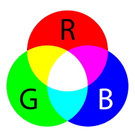
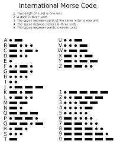
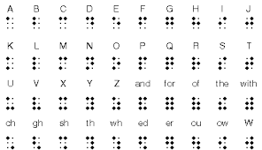
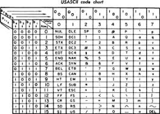

# 色彩表示科普

## RGB系统

>The RGB color model is an additive color model in which red, green and blue light are added together in various ways to reproduce a broad array of colors. The name of the model comes from the initials of the three additive primary colors, red, green, and blue.  
>By wikipedia

RGB系统是使用三原色(Red, Green, Blue)为底色，按比例调制成其他颜色的系统。

在计算机系统中，显示屏是由密密麻麻的像素(pixel)构成的，每个像素点接受显卡的控制，按照RGB信号显示出不同的颜色来，由于像素点过于密集人眼看过去就是连续的图像。

    ·color depth(用多少bits存RGB数据)
            1. HiColor  -> 16-bit color depth RGB分别用5bits存
            2. TrueColor -> 24-bit color depth(RGB24)
            当前典型的显示适配器为每个像素使用多达24位的信息：每个组件8位乘以三个组件,允许使用16,777,216（256 3或2 24）个R，G和B值的离散组合。(一些格式如.png和.tga文件等使用第四灰度色通道作为屏蔽层，通常称为RGB32)

# 编码科普

## Morse Code

>Morse code is a method of transmitting text information as a series of on-off tones, lights, or clicks that can be directly understood by a skilled listener or observer without special equipment. 
>By wikipedia

摩尔斯电码是一种时通时断的信号代码，通过不同的排列顺序来表达不同的英文字母、数字和标点符号。摩尔斯电码是一种早期的数字化通信形式，但是它不同于现代只使用零和一两种状态的二进制代码，它的代码包括五种： 点、划、点和划之间的停顿、每个词之间中等的停顿以及句子之间长的停顿。

在电报机时代有着极为广泛的应用。

## Braille
>Braille (/breɪl/; French: [bʁaj]) is a tactile writing system used by people who are visually impaired. It is traditionally written with embossed paper. Braille users can read computer screens and other electronic supports using refreshable braille displays. They can write braille with the original slate and stylus or type it on a braille writer, such as a portable braille notetaker or computer that prints with a braille embosser. 
>By wikipedia

盲文或称点字、凸字，是专为盲人设计、靠触觉感知的文字。透过点字板、点字机、点字打印机等在纸张上制作出不同组合的凸点而组成，一般每一个方块的点字是由六点组成，左侧从上到下为123，右侧为456，叫一方。

布莱叶年幼时失明，且深受当时的落后盲文系统的苦，但机缘巧合之下发明了更先进的盲文系统，为更多失明人士带来了福音。

## ASCII

>ASCII (/ˈæskiː/ ( listen) ASS-kee), abbreviated from American Standard Code for Information Interchange, is a character encoding standard for electronic communication. ASCII codes represent text in computers, telecommunications equipment, and other devices. Most modern character-encoding schemes are based on ASCII, although they support many additional characters.  
>By wikipedia

ASCII是早期美国提出的一套编码系统，将二十六个英文字母，十个阿拉伯数字，以及一些特殊字符和不可见字符囊括在内。

一个ASCII字符占用一个byte的空间。但有一个bit不用于存储字符(也没那么多来存)，这个bit在后来的编码系统中起到了别的左右(例如在GBK这一位用来识别英文中文)

## Unicode

>Unicode is a computing industry standard for the consistent encoding, representation, and handling of text expressed in most of the world's writing systems. 
>By wikipedia

随着时间的推移，ASCII码没法满足非拉丁文地区人民的需求了(例如日本，韩国，中国)，于是大家开发出了一套新的编码字符集，旨在囊括世界上所有的文字。

一个Unicode编码用两个byte保存，也就是16位，可以表示六万多个字符。

## utf-8

>UTF-8 is a variable width character encoding capable of encoding all 1,112,064 valid code points in Unicode using one to four 8-bit bytes. 
>By wikipedia

utf-8出现的背景是Unicode所占用的空间过大，且会造成资源浪费。
于是utf-8应运而生，由于utf-8是在Unicode的标准下制定的，所以它的应用更广泛，同时由于它兼容ASCII，所以兼容性好，逐渐成为当下主流的字符系统。