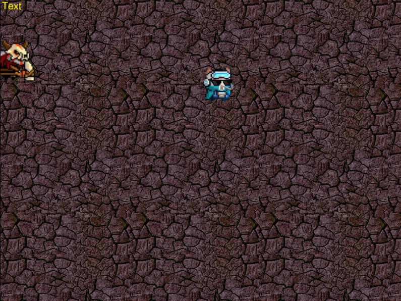
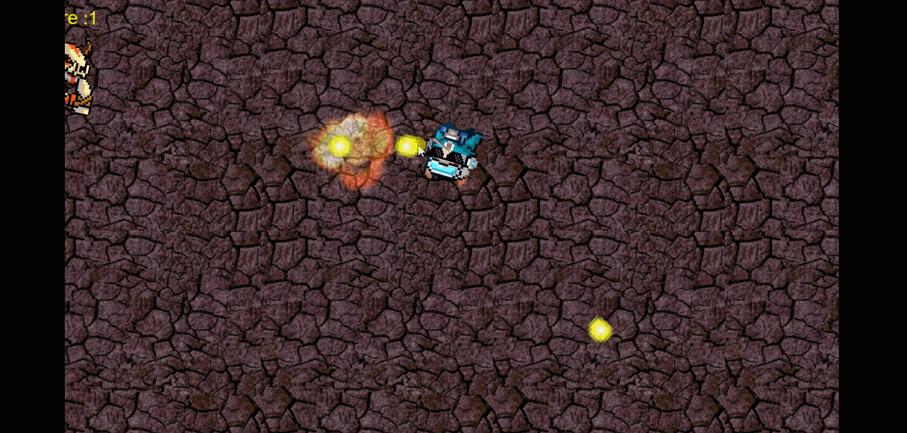

# Concept

## Setting
邪恶的大巫师(Archwizard)侵略了王国，并掳走了公主(princess)，吊儿郎当的邋遢气势，也不得不振作起来，前往地下城，夺回美丽的公主。

## Gameplay

玩家杀死哥布林祭司及大巫师即可救出公主，完成任务。玩家与哥布林祭司或与大巫师的魔法子弹碰撞后死亡，任务失败。大巫师将在击杀五只哥布林祭司后出现。玩家通过鼠标和键盘上下左右键控制移动，并通过鼠标左键释放子弹，攻击怪物。

## Game sprites
1. Player: sloppy knight, one HP, enabled to shoot
2. Monsters: Goblin priest, high speed, unable to shoot
3. Boss: Archwizard, five HP, enabled to shoot magic bullets(bigger)

## targered people

Dungeon fans

## Creation motive

Not much, just love it.

## Result





## CRC
```
+----------------------------------------------------+  
|    Object Name:                Knight              |  
+----------------------------------------------------+
|    Attributes:                 One HP              |
+--------------+-------------------------------------+
|    Collaborator       |     Events & Actions       |
+-------------------+--------------------------------+
|  Hero must be alone   |     Shoot Bullets          |
|  Hero must be alone   |      8 directions          |
|  Hero must be alone   |  Destroy on collision with | 
|  Hero must be alone   |    BULLET, or GOblins      |
+--------------+-------------------------------------+
```
```
+----------------------------------------------------+  
|    Object Name:             Goblin priest          |  
+----------------------------------------------------+
|    Attributes:                 One HP              |
+--------------+-------------------------------------+
|    Collaborator       |     Events & Actions       |
+-------------------+--------------------------------+
|  evil Archwizard      |      no Shoot Bullets      |
|  evil Archwizard      |     Only charge direct     |
|  evil Archwizard      | Destroy on collision with  | 
|  evil Archwizard      |          bullet            |
+--------------+-------------------------------------+
```

```
+----------------------------------------------------+  
|    Object Name:              Archwizard            |  
+----------------------------------------------------+
|    Attributes:                 Five HP             |
+--------------+-------------------------------------+
|    Collaborator       |     Events & Actions       |
+-------------------+--------------------------------+
|  Loyal Goblin priest  |     Shoot Magic Bullets    |
|  Loyal Goblin priest  | Approach the player slowly |
|  Loyal Goblin priest  |  Destroy on collision with | 
|  Loyal Goblin priest  |    bullte for five times   |
+--------------+-------------------------------------+
```
```
+----------------------------------------------------+  
|    Object Name:                Bullet              |  
+----------------------------------------------------+
|    Attributes:                speed, size          |
+--------------+-------------------------------------+
|    Collaborator       |     Events & Actions       |
+-------------------+--------------------------------+
|  The hero, its master |      Bullets speed         |
|  The hero, its master |       Smaller one          |
|  The hero, its master |  Destroy on collision with | 
|  The hero, its master |    Archwizard, or GOblins  |
+--------------+-------------------------------------+
```

```
+----------------------------------------------------+  
|    Object Name:              Magic Bullet          |  
+----------------------------------------------------+
|    Attributes:                 Speed, size         |
+--------------+-------------------------------------+
|    Collaborator       |     Events & Actions       |
+-------------------+--------------------------------+
| Archwizard, its master |     Bullets speed         |
| Archwizard, its master |       Bigger one          |
| Archwizard, its master |  Destroy on collision with| 
| Archwizard, its master |       the Knight          |
+--------------+-------------------------------------+
```


