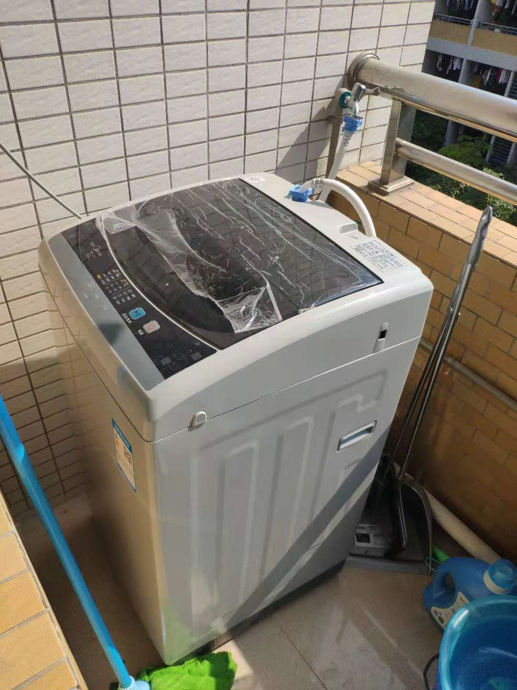

# 自顶向下，逐步求精

自顶向下，由系统问题分解成小问题，时间刻度上过程化地解决每一步；空间刻度上，将问题细分，规模减小，并逐个解决。

<pre>

正常洗衣：(瀑布模型)
通电 -> 放衣服(放洗衣粉) 
        -> 注水 
            -> 停止注水 
                -> 电机运行 -> 电机停止 
                    -> 放水 -> 停止放水 
                        -> 停机 
</pre>

If something goes wrong, just **RAISE** errors(halt).

<pre>
Put clothes in
water_in_switch(open)
REPEAT Put water in
UNTIL get_water_volume() equal standard_volume
water_in_switch(close)
SET jinpaos to time_counter() 
WHILE time_counter() - jinpaos < standard_time
浸泡clothes
END WHILE
SET jinpaof to time_counter()
REPEAT 
motor_run(left)
motor_run(right)
UNTIL time_counter() - jinpaof >= standard_time2
motor_run(stop)
water_out_switch(open)
REPEAT Push water
UNTIL get_water_volume() == 0
water_out_switch(close)
SET paishui to time_counter()
REPEAT 
motor_run(left)
motor_run(right)
UNTIL time_counter() - paishui >= standard_time3
halt(success)
</pre>

<!-- >
复制粘贴是个好东西.

>
----鲁迅
 -->

