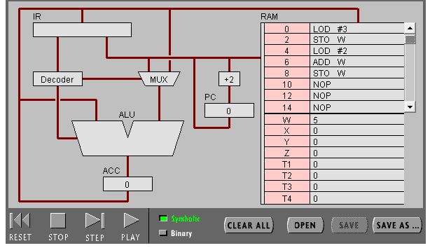
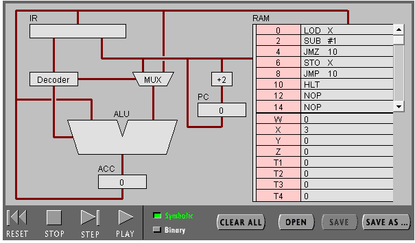
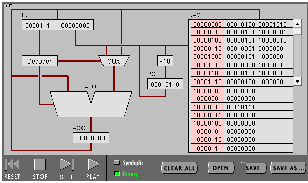
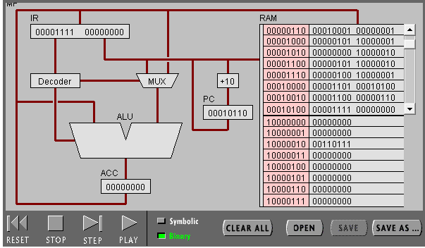

# 谢正雄 18342106的实验报告
## 实验目标：熟悉汇编语言

### 任务 1：简单程序(step by step questions)

#### 1. PC，IR 寄存器的作用。

PC里存着下一条CPU要运行指令的地址<br/>
IR里存着当前运行的命令
#### 2. ACC 寄存器的全称与作用。  
ACC(accumulater)， 累加器，用于暂存ALU的临时数据
#### 3. 用“LOD #3”指令的执行过程，解释Fetch-Execute周期。

CPU 先 fetch PC 内容指向的的命令(LOD #3)，再存在 IR 中，在递交给 Decoder，随后经由MUX(3), ALU执行运算后，将数据(3)存在ACC中, PC自行累加, 然后开始取下一条命令

#### 4. 用“ADD W” 指令的执行过程，解释Fetch-Execute周期。

CPU 先 fetch 'ADD W' ，然后 decode ，将地址 W 的值与 ACC 里的值相加， 再存在 ACC 里， 之后 PC 自行累加。

#### 5. “LOD #3” 与 “ADD W” 指令的执行在Fetch-Execute周期级别，有什么不同。

取值模式不同，前者无需去内存中取数据，后者需要读取内存中的值

### 任务 1：简单程序(binary questions)
#### 1. 写出指令 “LOD #7” 的二进制形式，按指令结构，解释每部分的含义。

00010100 00000111

1. 对于'00010100'<br/>
'0001' means immediate mode addressing<br/>
'0100' means the instruction 'LOD'
2. 对于'00000111'<br/>
just the operand specifer

#### 2. 解释 RAM 的地址。

地址就是内存编号，分配给相应内容的唯一编号

#### 3. 该机器CPU是几位的？（按累加器的位数）

8位

#### 4. 写出该程序对应的 C语言表达。

```c
int 8_t W = 3;
int 8_t X = 7;
int 8_t Y = W + X;

```

### 任务 2：简单循环(program2)


#### 1. 用一句话总结程序的功能

用循环将x减为0

#### 2. 写出对应的 c 语言程序

```c
int 8_t X = 3;
for (; x > 0 ; x -- );
```


### 任务 2：简单循环(program2 refresh)
#### 1. 写出 c 语言的计算过程

```c
int 8_t X = 10;
int Y = 0;
for (; X > 0 ; X --  ){
    Y += X;
}
```

#### 2. 写出机器语言的计算过程





#### 3. 用自己的语言，简单总结高级语言与机器语言的区别与联系

高级语言一言胜千言，仅使用几个保留字和运算符就表达了整个可能用汇编语言要几十步才能表达完的运算过程，但高级语言的操作总是可以用汇编语言来实现，有共性在里面。

## 小结

汇编真难写, 但和c语言有很多相似的思想，和python差的有点多-_- ,但都是基本的程序结构，汇编也是命令式语言的一种呢。<br/>
ADD STO LOD JMP JMZ HLT SUB DIV MUL(基本上用这些) 