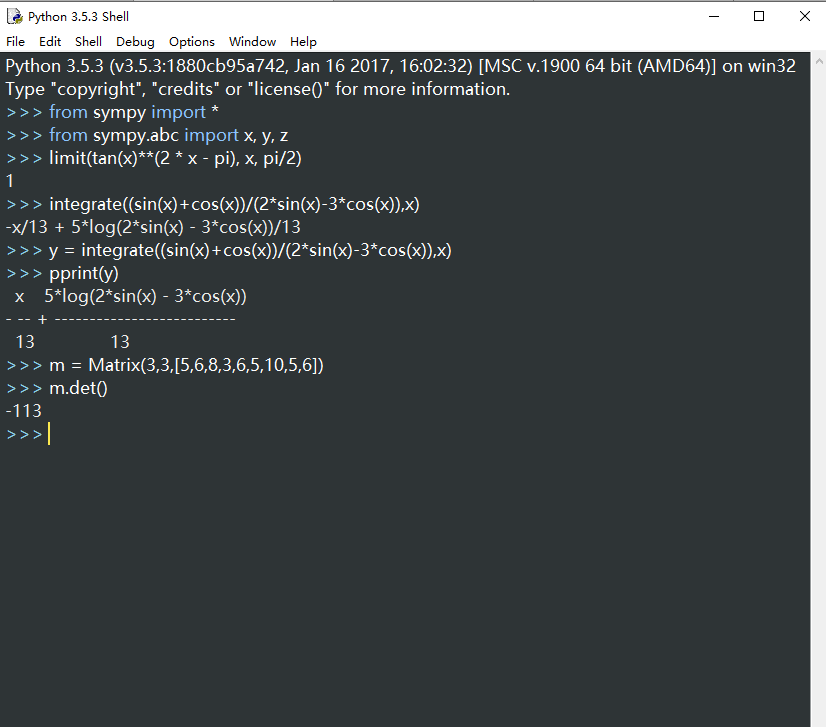

# 实验报告: 用 Python 做计算器

<h2 align = "right">学号：18342106 </h2>
<h2 align = 'right'>姓名：谢正雄</h2>

## 实验目标：学会使用 sympy 库解决数学问题

## 步骤1. 用 Python 解决高数问题

`For example`，求极限

`再比如`，求不定积分

只要寥寥几行就能解决，这些困扰了我们许久的大问题

## 步骤2. 用 Python 解决线代问题

`For example` 求行列式

`再比如`求逆矩阵

## 实验小结：
本次实验整体来说结果算是成功, 虽然其间不少有磕磕碰碰。 不得不说，sympy 是一个对新手及其友好的库，而且函数封装的很好，命名也很用心。使用 sympy 库可以极其高效地完成如求积分，求导，级数展开，矩阵运算等等，相比之下，c 就...

>人生苦短，我用 Python。

