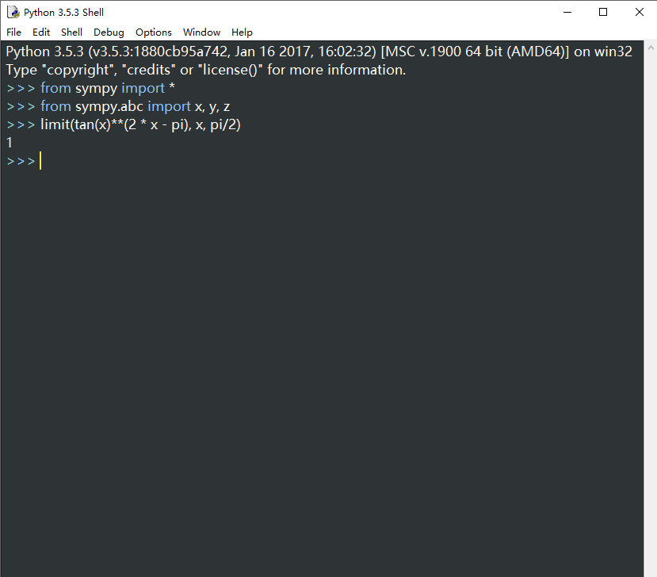

# 实验报告: 用python做计算器

<h2 align = "right">学号：18342106 </h2>
<h2 align = 'right'>姓名：谢正雄</h2>

<a name = "#hypermath">
<h2>1. 用python解决高数问题 </h2></a>
<a name = "#linear">
    <h2>
    2. 用Python解决线代问题
    </h2>
</a>

})