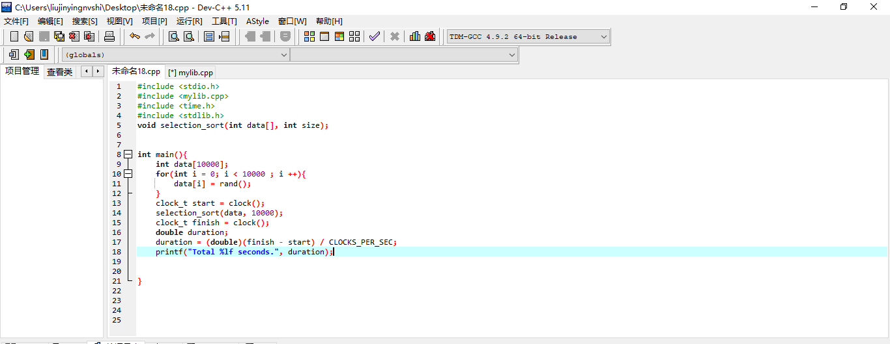
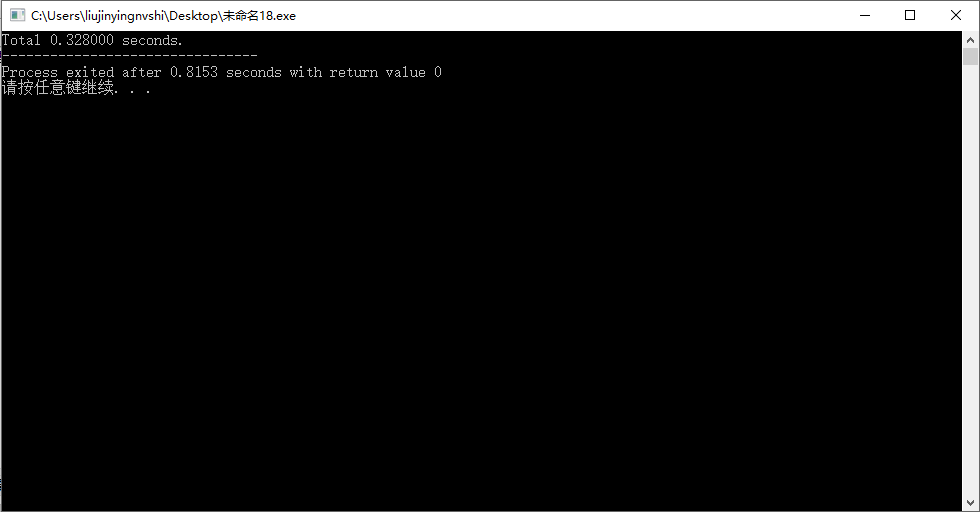
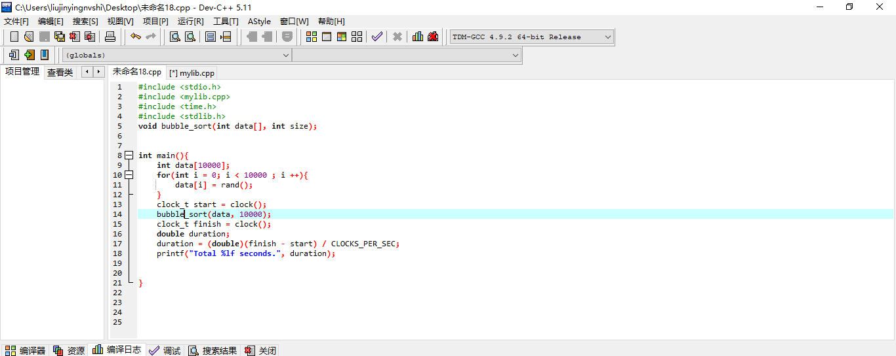
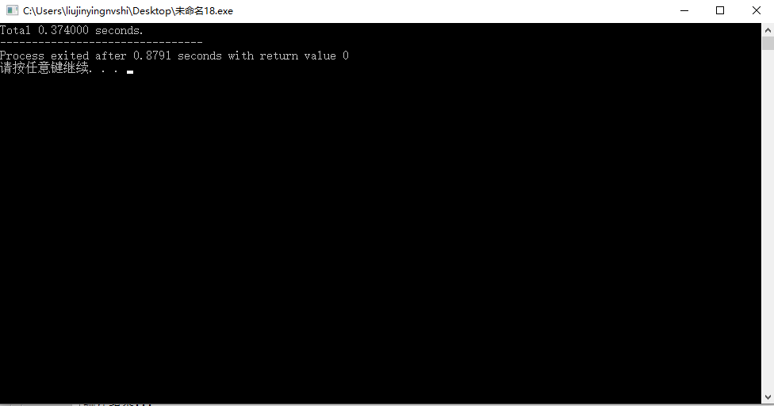
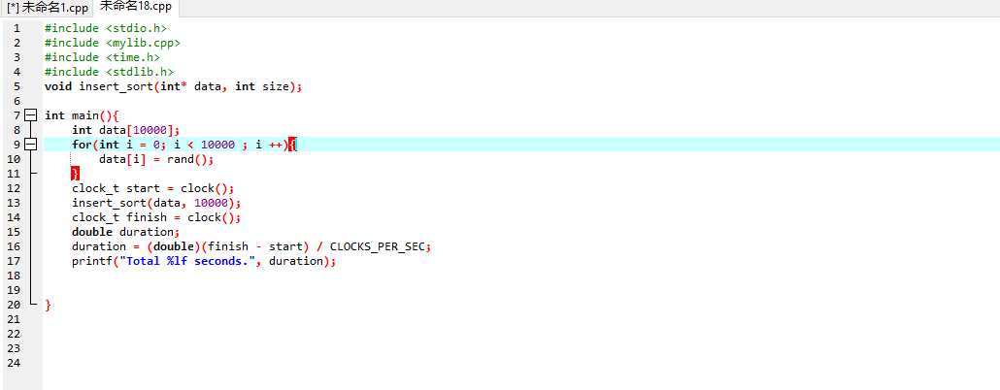
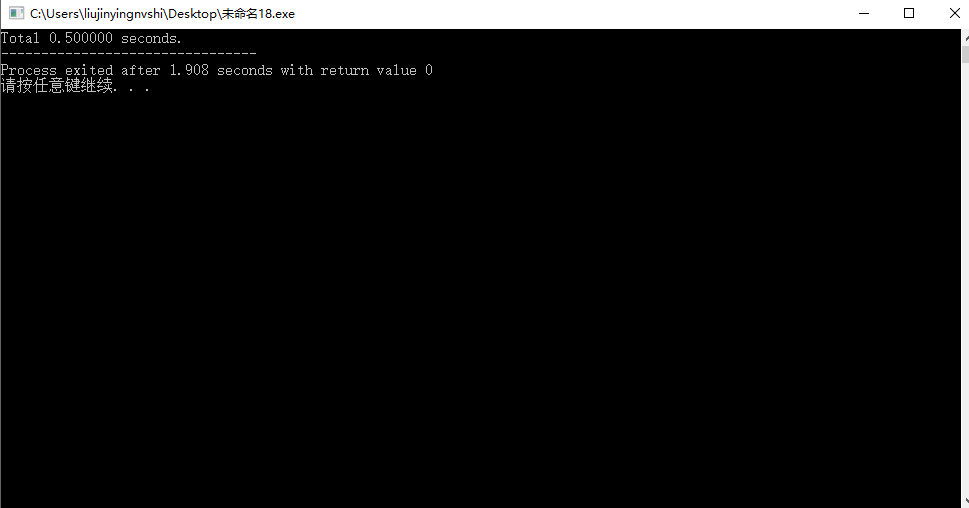

# 选择排序
```c
void  select_sort(int *data, int size){
    for (int i = 0; i < size ; ++ i){
        for (int j = i + 1 ; j < size ; ++ j){
            if (data[i] > data[j]){
                int temp = data[j];
                data[j] = data[i];
                data[i] = temp;
            }
        }
    }

}
```






# 冒泡排序
```c
void bubble_sort(int *data, int size){
    for (int i = size - 1; i > 0; --i){
        for (int j = 0 ; j < i ; ++ j){
            if (data[j] > data[j + 1]){
                int temp = data[j];
                data[j] = data[j + 1];
                data[j + 1] = temp;
            }
        }
    }

}
```





# 插入排序
```c
void insert_sort(int* data, int size){
    int j;
    for(int i = 1; i < size ; ++ i){
        for (j = 0 ; j < i && data[j] > data[i] ; ++ j);
        int temp = data[i];
        for (int k = i ; k > j ; -- k){
                data[k] = data[k - 1];
        }
        data[j] = temp;
    }
}
```





# 可以发现上述三种算法在这种情况下耗时差不多

