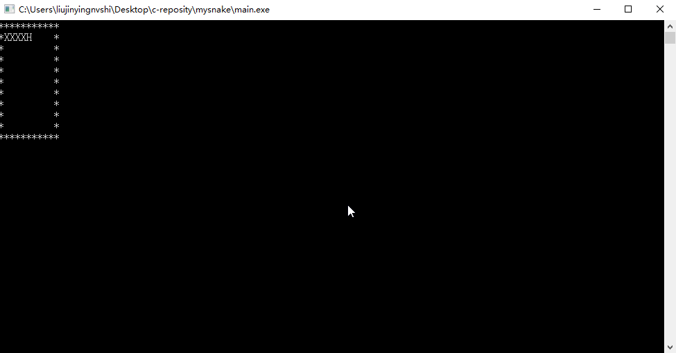

# 贪吃蛇1号

很抱歉的是，“我的蛇”只是一个半成品。

我的想法是这样的，先不考虑食物的因素，只涉及蛇的移动，即先构建一个map，再用一个二维数组表示蛇的每一部分的坐标，然后在判定移动的时候，只有蛇头的坐标变化，其他部分的坐标变成前一部分的坐标，这样就能实现蛇坐标的变化

然后可以根据坐标打印蛇，为了不残留身体，可以再每次打印前先清空蛇。这样问题就变成了： 
    清空蛇 -> 蛇头坐标变化 -> 身体坐标变化 -> 打印蛇

但由于种种bug，而且本人还没有找出问题所在，结果变成了这样

希望以后能改进这条蛇