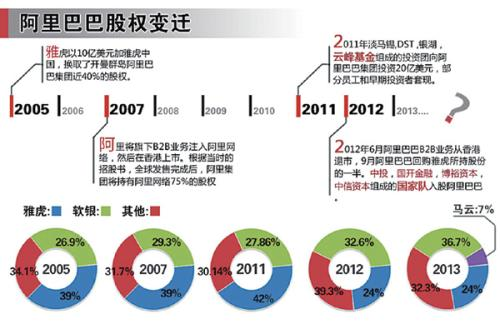

# 风险投资
<head> 全文大量引用《浪潮之巅》</head>

**风险投资**（英语：**Venture Capital**，缩写为**VC**）简称风投，又译称为创业投资，是一种私募股权，一种融资形式，由公司或基金提供给被认为具有高增长潜力或已经表现出高增长的小型早期新兴公司（员工数量，年收入或两者兼而有之）。

和抵押贷款不同，风投是无抵押的，一旦投资失败就血本无归。
## 风投的起源
<blockquote>
凡是现实的都是合理的；凡是合理的都是现实的。

黑格尔

</blockquote>
风投在上个世纪60年代后的美国蓬勃兴起。二战后的美国代替英国主导了世界的金融业，二战后的较长时间里，美国是资本的净输出国，罗斯福和杜鲁门两任总统努力建立了完整的社会保障制度和信用制度，使得信用成为美国社会的基础，没加公司都有自己的信用记录，一个人在诚信上犯了错误，改了也不是好人。这是风投在美国盛行的社会基础。美国工业化时间长，商业发达，与商业有个的法律健全，也容易保护风险投资。

对私有企业的投资大致有两种，一种是收买长期盈利看好但暂时遇到困难的企业，比如巴菲特就常常这样做，第二种是投资一个初创小公司，将它做大上市后被收购，后者往往是风投的对象。前者又被称为私募基金(Private Equity Funds)。
风险投资是在和最聪明的人打交道，风投的关键是准确评估一项技术，并遇见为了科技的发展趋势，所以有人说，风投是世界上最好的行业。

## 风投的结构(看不懂)

公司结构：常常没有总裁或CEO，最高管理者是公司的合伙人(Partners)，常常合伙人不仅在公司内部地位高，在科技界也是大佬

天使投资人，相比于红杉资本这样的大体量的投资公司，天使投资钟情于投资小型公司，如果把红杉资本比作按照相应规则严格运作的机器，而天使投资人更像是一群富豪群，他们中间并没有严格的规则来联系，没有什么义务，大家坐在一起讨论问题，共同使用一个律师和会计。

## 风险投资就是投人
>风险投资就是投人。
>
----风投教父之一William Draper

## 风投与中国
### 风投与 Alibaba

<blockquote>
在1999年阿里巴巴成立后没多久它却遭遇了发展的瓶颈：公司账上没钱了。后来由于蔡崇信的关系马云得到了一笔“天使基金”——500万美元。
    
1999年秋，日本软银总裁孙正义约见了马云，并给了他2000万美元的软银投资，阿里巴巴管理团队绝对控股。
    
软银不是阿里巴巴的第一个风险投资商，却是坚持到最后的那个。1999年10月，马云私募到手第一笔天使投资500万美元，由高盛公司牵头，联合美国、亚洲、欧洲一流的基金公司参与。在阿里巴巴的第二轮融资中，软银开始出现。
    
2000年，马云为阿里巴巴引进第二笔融资，2500万美元的投资来自软银、富达、汇亚资金、TDF、瑞典投资6家风险投资商，其中软银为2000万美元，阿里巴巴管理团队仍绝对控股。
    
2004年2月，阿里巴巴第三次融资，再从软银等风险投资商手中募集到8200万美元，其中软银出资6000万美元。马云及其创业团队仍然是阿里巴巴的第一大股东，占47%股份；第二大股东为软银，约占20%；富达约占18%；其他几家股东合计约15%。
    
软银在阿里巴巴上市当天账面上获得了巨额的回报。阿里巴巴招股说明书显示，软银持有阿里巴巴集团29.3%股份，而在行使完超额配售权之后，阿里巴巴集团还拥有阿里巴巴公司72.8%的控股权。由此推算，软银间接持有阿里巴巴21.33%的股份。到收盘时，阿里巴巴股价达到39.5港元。市值飙升至1980亿港元(约260亿美元)，软银间接持有的阿里巴巴股权价值55.45亿美元。若再加上2005年雅虎入股时曾套现1.8亿美元，软银当初投资阿里巴巴集团8000万美元如今回报率已高达71倍，而这高风险也是最终给予了投资阿里投资人极高的回报。

<i>-----转自https://blog.csdn.net/core37/article/details/78842451</i>

</blockquote>

### 风投和共享单车