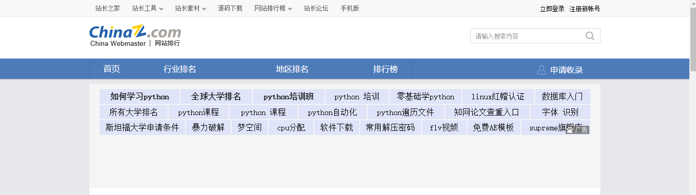
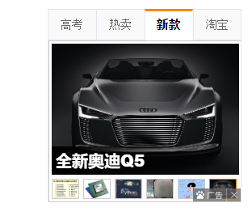
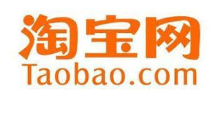
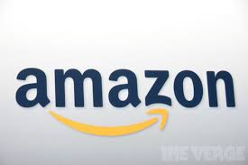

# 以“流量”为主导的互联网盈利模式

开放、免费和盈利,Yahoo开创了互联网经济的游戏规则，用吴军博士的话讲"也正是因为他们(指Yahoo的两位创始人)的贡献，我们得以从互联网上免费得到各种信息，并通过互联网传递信息，分享信息，我们的生活因此改变。也许一百年后雅虎公司会不复存在，但是人们会把他们两和爱迪生、贝尔及福特相提并论。" 
我们从Yahoo的兴衰史就能看出流量(traffic)在经济中的重要性，可惜了Yahoo，Yahoo曾顺利的站在技术革命的浪尖之上，但很显然后来的Yahoo并没有抓住机会成为时代的弄潮儿

吴军博士在书中写到"在2000年，如果要问‘什么对互联网公司最重要’百分之九十以上的人会回答'流量'，但直到今天很多人的答案依然如此",运营商们可以光靠提供网络服务来收费，但对于很多互联网公司来说，此流量非彼流量，不是手机电脑使用的几G几M的流量，而更类似点击量或是阅读量

在互联网泡沫未破灭之前的那个年代里，几乎所有互联网公司无论是否能盈利，只要有一定规模的流量几乎都能拿到大笔的融资，大多数创业者连产值都不考虑，觉得只要有了流量就有了一切，一度使互联网充斥着垃圾网页
# 在线广告
## 搜索引擎网站的广告(以及受人诟病的百度推广)

不得不说Google比baidu友好多了,当然现在的百度比以前好多了

## 充斥着门户网站的广告

## 公众号广告

# 网络游戏 ： 氪，氪，氪
***

网络游戏吸引人的虽然看游戏的可玩度，但ip流量带来的效益却是不可忽视，playful blue moon这款游戏的可玩性实在不敢恭维，但依然不影响它的大火，主要原因就是它**受人喜爱**的宣传片，流量功不可没。其他两款游戏除了高度的可玩性外，和宣传和ip是离不开的

# 电子商务
----------

以上就是中国电商三巨头，当然曾经的并夕夕也火了一段时间，但仅拥有流量但没有实质内容是不行的，之后就因为商品质量不高凉凉

B2B、B2C、C2C、O2O模式

平台可以通过收取佣金来盈利，流量越大的平台往往会有更高的信誉

# 特定网络服务

冲会员，VPS等

越知名的网络平台往往可以拉拢更多的客户

