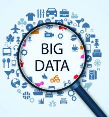
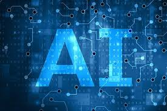
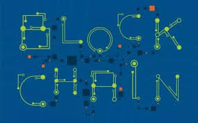
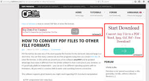

# 互联网热点选择

## 大数据

<blockquote>
<b>大数据</b>（big data），指无法在一定时间范围内用常规软件工具进行捕捉、管理和处理的数据集合，是需要新处理模式才能具有更强的决策力、洞察发现力和流程优化能力的海量、高增长率和多样化的信息资产。

<i>https://baike.baidu.com/item/%E5%A4%A7%E6%95%B0%E6%8D%AE/1356941?fr=aladdin</i>

</blockquote>

## AI
<blockquote>
<b>人工智能</b>（Artificial Intelligence），英文缩写为AI。它是研究、开发用于模拟、延伸和扩展人的智能的理论、方法、技术及应用系统的一门新的技术科学。 
人工智能是计算机科学的一个分支，它企图了解智能的实质，并生产出一种新的能以人类智能相似的方式做出反应的智能机器，该领域的研究包括机器人、语言识别、图像识别、自然语言处理和专家系统等。人工智能从诞生以来，理论和技术日益成熟，应用领域也不断扩大，可以设想，未来人工智能带来的科技产品，将会是人类智慧的“容器”。人工智能可以对人的意识、思维的信息过程的模拟。人工智能不是人的智能，但能像人那样思考、也可能超过人的智能。 
人工智能是一门极富挑战性的科学，从事这项工作的人必须懂得计算机知识，心理学和哲学。人工智能是包括十分广泛的科学，它由不同的领域组成，如机器学习，计算机视觉等等，总的说来，人工智能研究的一个主要目标是使机器能够胜任一些通常需要人类智能才能完成的复杂工作。

<i>https://baike.baidu.com/item/%E4%BA%BA%E5%B7%A5%E6%99%BA%E8%83%BD/9180?fr=aladdin</i>

</blockquote>

## 区块链
<blockquote>
<b>区块链</b>是分布式数据存储、点对点传输、共识机制、加密算法等计算机技术的新型应用模式。 
<b>区块链</b>（Blockchain），是比特币的一个重要概念，它本质上是一个去中心化的数据库，同时作为比特币的底层技术，是一串使用密码学方法相关联产生的数据块，每一个数据块中包含了一批次比特币网络交易的信息，用于验证其信息的有效性（防伪）和生成下一个区块。

<i>https://baike.baidu.com/item/%E5%8C%BA%E5%9D%97%E9%93%BE/13465666?fr=aladdin</i>

</blockquote>

# 互联网营销方法
## 搜索引擎营销
竞价排名、分类目录、搜索引擎登录、付费搜索引擎广告、关键词广告、搜索引擎优化(搜索引擎自然排名)、地址栏搜索、网站链接策略灯等

## 博客营销
付费博客，广告等

## 网络软文营销
稿费，广告等

## 病毒式营销
最近很火的**锦鲤**抽奖就是类似的营销手段

<b>还有许多的营销手段，但都大同小异，要明白本质的仍是，流量流量流量</b>

*References*:
<pre>
1. 智放营销：十五种常用的互联网营销方法https://www.sohu.com/a/226699842_124310
2. 常用的互联网营销方法https://jingyan.baidu.com/article/cd4c2979357f21756e6e6084.html
</pre>

祝期末考好...